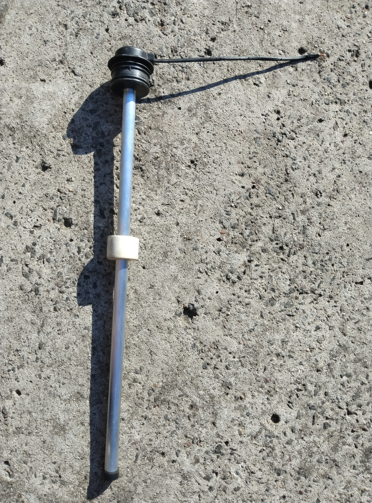
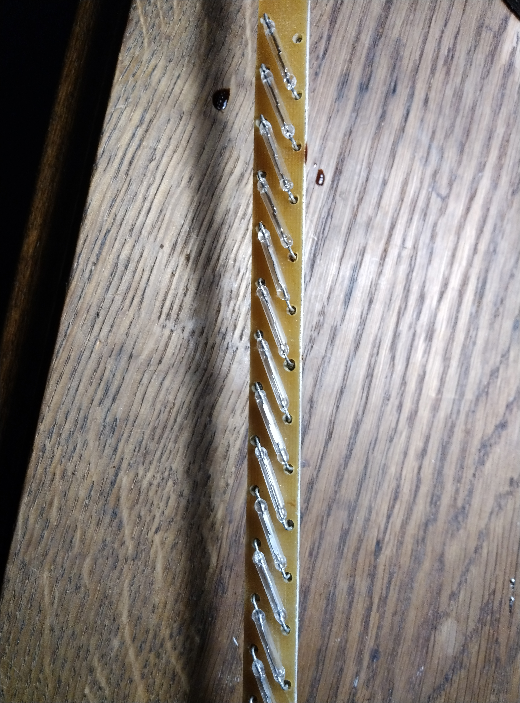
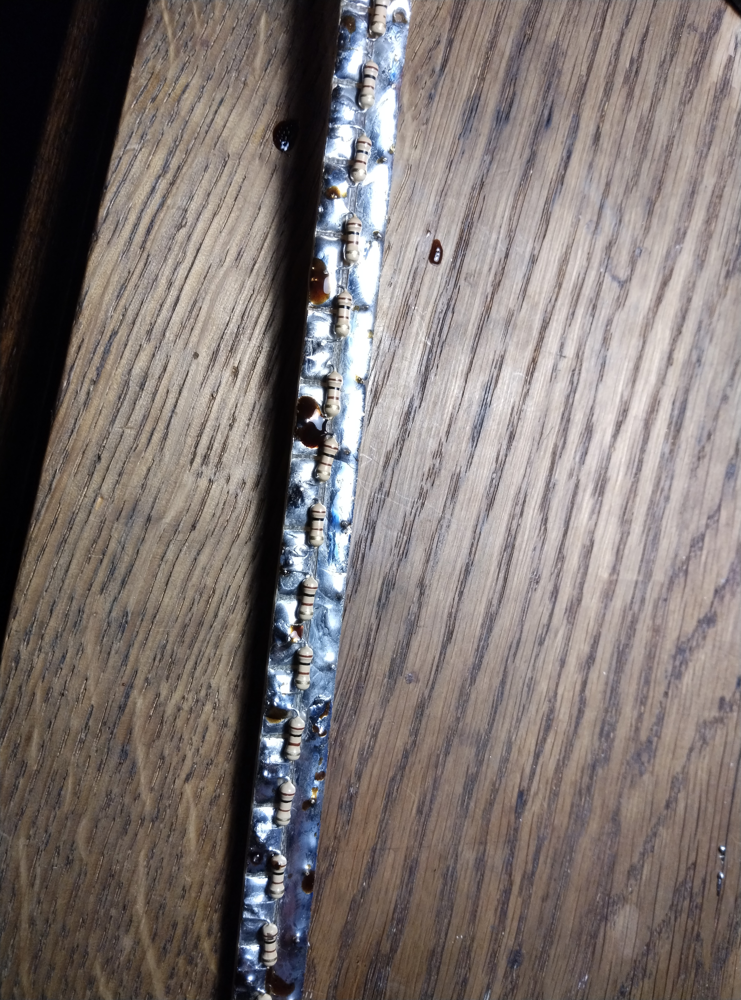
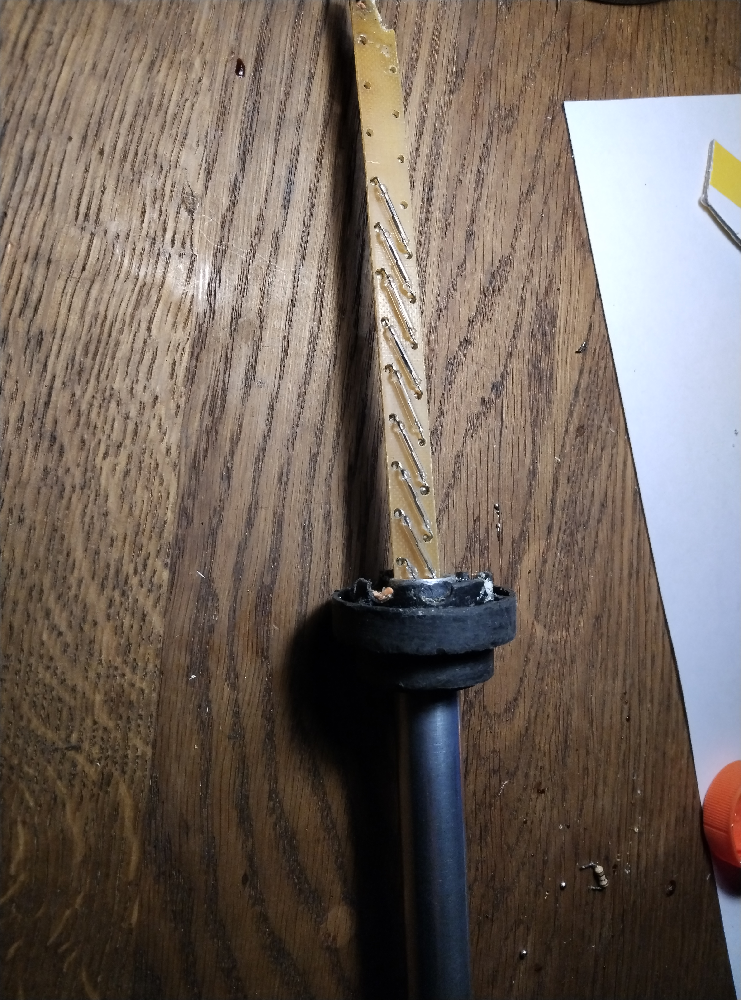
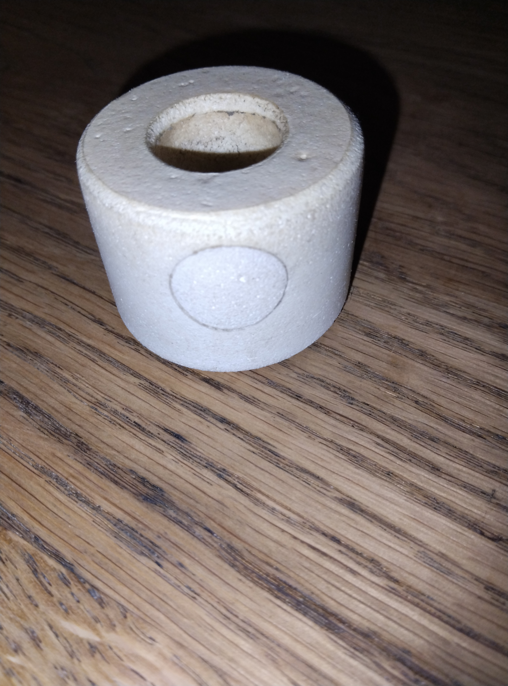

# V-Rod-Custom-Fuel-Level-Sensor
A custom DIY microcontroller-based (Arduino NANO Super Mini Atmega328) fuel level sensor for Harley-Davidson V-Rod. Replaces the unreliable factory ultrasonic sensor with a magnetic reed-switch array.

# Harley-Davidson V-Rod Custom Fuel Level Sensor

This project is a complete DIY replacement for the notoriously unreliable factory ultrasonic fuel level sensor found on Harley-Davidson V-Rod motorcycles. 

## The Problem
The OEM ultrasonic sensor is prone to failure due to vibrations, temperature changes, and piezo-element degradation. When it fails, the fuel gauge typically shows "Full" or drops to zero randomly.

## The Solution
This project replaces the ultrasonic unit with a highly reliable **magnetic reed-switch array**, processed by an **Atmega328 microcontroller**. It provides a perfectly stable analog signal (current sink) to the instrument cluster, perfectly mimicking a working OEM sensor.

### Hardware Features

* **Sensor Probe:** Aluminum tube housing an array of 40 reed switches and resistors.

* **Float:** Custom-shaped fuel-resistant float with embedded neodymium magnets.

* **Microcontroller:** Arduino NANO Super Mini Atmega328.
* **Signal Output:** Custom transistor-based circuit (AO3400A) providing a stable current sink for the dashboard, regardless of alternator voltage spikes.

## Tank Calibration
The V-Rod fuel tank has a complex, irregular shape. To ensure absolute accuracy (including the "Miles to Empty" range calculator), the sensor was mapped by filling the tank liter by liter with actual fuel.

## Schematic & PCB

## Source Code
The firmware is written in Arduino IDE. It features heavy digital filtering (exponential moving average) to prevent gauge needle bouncing when fuel sloshes during riding.

