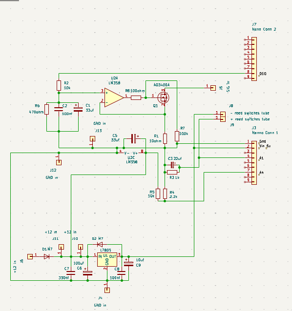

# V-Rod-Custom-Fuel-Level-Sensor

Самодельный датчик уровня топлива на базе микроконтроллера (Arduino NANO Super Mini Atmega328) для мотоцикла Harley-Davidson V-Rod. Заменяет ненадежный заводской ультразвуковой датчик на плату с магнитными герконами.

## Проблема

Заводской ультразвуковой датчик (OEM) часто выходит из строя из-за сильных вибраций, резких перепадов температур и постепенной деградации пьезоэлемента. При его поломке стрелка указателя топлива на приборной панели обычно зависает на отметке «Полный» или хаотично падает на ноль.

## Решение

В данном проекте ультразвуковой датчик заменен надежным **зондом на основе герконов и магнита**, показания с которого обрабатываются микроконтроллером **Atmega328**. Устройство формирует стабильный аналоговый сигнал (управление током) для приборной панели, полностью имитируя работу исправного заводского датчика.

### Аппаратные особенности

- **Измерительный зонд:** Алюминиевая трубка, внутри которой размещена плата с 40 герконами и резисторами.

- **Поплавок (ПХВ-2-195):** Изготовлен на станке из авиационного закрытоячеистого пенополивинилхлорида **ПХВ-2-195**. В отличие от обычных пластиков или строительной пены, данный материал на 100% устойчив к высокооктановому бензину и смесям с этанолом, никогда не впитывает топливо и надежно удерживает два неодимовых магнита внутри своей конструкции.

- **Микроконтроллер:** Arduino NANO Super Mini Atmega328.
- **Активный контур обратной связи (LM358 + AO3400A):**  
  Это ключевой узел аппаратной части устройства. Простое использование транзистора с ШИМ-управлением для замыкания сигнального провода приборки на массу приводило бы к сильным колебаниям стрелки из-за скачков напряжения генератора (от 12.5 В на холостом ходу до 14.4 В при езде). Чтобы исключить это влияние, в проекте используется сочетание аппаратного источника стабильного тока и динамической программной компенсации:

  1. **Аппаратный источник стабильного тока:** Arduino Nano выдает высокочастотный ШИМ-сигнал, который сглаживается RC-фильтром в стабильное постоянное опорное напряжение. Это опорное напряжение подается на неинвертирующий вход операционного усилителя LM358. Работая в замкнутом контуре обратной связи с N-канальным MOSFET-транзистором AO3400A и шунтом в цепи истока, LM358 непрерывно регулирует напряжение на затворе транзистора. Это обеспечивает точное и стабильное потребление тока (в диапазоне от 12 мА до 20 мА) от приборной панели, защищая сигнал от быстрых электрических помех в бортовой сети.
  2. **Динамическая компенсация напряжения:** Несмотря на то, что источник стабильного тока сглаживает выходной сигнал, колебания общего напряжения мотоцикла (с 12.5 В до 14.4 В) все же могут незначительно влиять на логику измерения тока внутри самой приборной панели. Для устранения этого эффекта Arduino Nano отслеживает системное напряжение через резистивный делитель, подключенный к аналоговому пину. Микропрограмма измеряет это напряжение в реальном времени и динамически корректирует скважность ШИМ, компенсируя просадки сети и удерживая стрелку в стабильном положении при любых режимах езды.

## Калибровка бака

Топливный бак V-Rod имеет сложную неправильную геометрию. Чтобы обеспечить высокую точность показаний (включая правильный расчет запаса хода «Miles to Empty» в бортовом компьютере), датчик калибровался путем пошагового заполнения бака реальным топливом — буквально литр за литром.

## Схема и печатная плата (PCB)

## Исходный код (Source Code)

Разработано специально для мотоциклов Harley-Davidson V-Rod, под сиденьем которых расположен бак сложной формы, из-за чего стандартные датчики уровня выдают крайне нелинейные показания.

Этот код преобразует нелинейный сигнал сопротивления от датчика-поплавка в плавный ШИМ-сигнал для аналогового указателя, равномерно распределяя объем топлива по меткам шкалы приборной панели (Пусто, 1/4, 1/2, 3/4, Полный).

## 🚀 Особенности (Features)

- **Алгоритм защиты от плескания (Anti-Slosh):** Двойная фильтрация сигнала (медианный фильтр + сглаживающий фильтр низких частот). Стрелка прибора не дергается при резком торможении, ускорении или в затяжных поворотах.
- **Индивидуальная калибровка бака:** Таблица поиска на 33 точки позволяет точно сопоставить объем бака любой геометрической формы с показаниями датчика.
- **Компенсация напряжения сети:** Показания датчика остаются точными даже при просадках напряжения (например, при включении головного света или вентиляторов радиатора), так как Arduino непрерывно контролирует вольтаж батареи и на лету корректирует ШИМ.
- **Режим калибровки шкалы:** Встроенный режим `CALIBRATION_MODE` позволяет быстро подобрать точные значения ШИМ под конкретный неоригинальный (aftermarket) указатель.

## 🛠 Аппаратная часть и подключение (Hardware & Wiring)

- **Микроконтроллер:** Arduino Nano / Pro Mini (или любая совместимая плата).
- **Вход датчика:** `A1` *(требуется подтягивающий резистор, номинал которого зависит от сопротивления вашего датчика).*
- **Мониторинг напряжения батареи:** `A4` ⚠️ **ВНИМАНИЕ:** Подключать строго через делитель напряжения! Напряжение в сети мотоцикла может превышать 14.5 В, что сожжет аналоговый пин Arduino при прямом подключении.
- **Выход на приборную панель:** `D10` *(ШИМ-выход на указатель).*

## 📐 Руководство по калибровке (Calibration Guide)

Если вы адаптируете этот проект под другой мотоцикл или бак, вам необходимо пройти процесс калибровки, состоящий из 2 шагов:

### Шаг 1: Калибровка положения стрелки прибора

1. Установите `bool CALIBRATION_MODE = true;` в начале кода.
2. Изменяйте значение переменной `TEST_PWM`, прошивайте плату и наблюдайте, на какой отметке шкалы останавливается стрелка приборной панели.
3. Найдите точные значения ШИМ для каждой отметки шкалы (Пусто, 1/4, 1/2, 3/4, Полный) и запишите их в массив `gPWM[]`.
4. В массиве `gLiters[]` укажите, какому объему в литрах соответствует каждая риска (например, для бака объемом 20.5 л шаг для каждого деления в 1/8 шкалы составит примерно 2.5 л).

### Шаг 2: Градуировка топливного бака

1. Установите `CALIBRATION_MODE = false;`.
2. Полностью слейте топливо из бака. Откройте монитор порта в Arduino IDE на скорости 115200 бод.
3. Запишите значение `Raw_Sensor` для пустого бака.
4. Наливайте топливо в бак небольшими точными порциями (например, по 1 литру) и фиксируйте показания `Raw_Sensor` на каждом шаге.
5. Перенесите полученные пары «АЦП — Литры» в массивы `rawTable[]` и `litersTable[]`.  
   *Важно: значения в массивах должны идти строго по возрастанию, без дублирования одинаковых значений АЦП подряд!*
